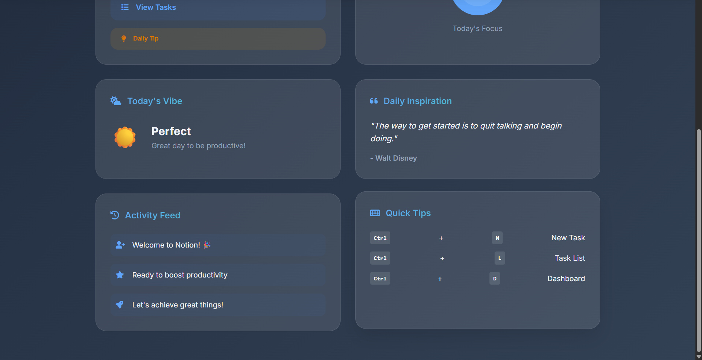

# Notion - Modern Laravel Task Managing Application

A comprehensive task management system built with Laravel, featuring a modern UI design and advanced task organization capabilities.

## 🚀 Features

### Core Functionality

-   **User Authentication** - Secure login/register system with custom styling
-   **CRUD Operations** - Create, read, update, and delete tasks
-   **Task Prioritization** - High, Medium, Low priority levels with color coding
-   **Due Date Management** - Date tracking with overdue detection
-   **Task Categories** - Organize tasks by Business, Casual, Fun categories
-   **Status Tracking** - Pending, In Progress, Completed status management
-   **Task Separation** - Active and completed tasks are organized separately
-   **Collapsible Completed Tasks** - Dropdown section for completed tasks with smooth animations
-   **Search & Sort** - Advanced filtering and sorting options for better task organization
-   **Overdue Detection** - Visual indicators for overdue tasks with warning messages

## 📸 Screenshots

### Dashboards and Registration


### Forms and Task Management




## 🛠️ Technology Stack

-   **Backend**: Laravel (PHP)
-   **Frontend**: Blade Templates, HTML5, CSS3, JavaScript
-   **Database**: MySQL/SQLite
-   **Styling**: Custom CSS with Glassmorphism effects
-   **Animations**: CSS Transitions and JavaScript
-   **Fonts**: Inter, Playwrite DE Grund
-   **Icons**: Font Awesome 6.4.0
-   **UI Framework**: Custom responsive design

## 📱 User Interface

### Dashboard Features

-   User profile display with gradient styling
-   Welcome message with highlighted username
-   Quick navigation to all sections

### Task Management

-   **Task Cards** - Glassmorphism design with priority borders
-   **Meta Information** - Due dates, priority badges, category labels
-   **Action Buttons** - View, Edit, Delete with confirmation
-   **Completion System** - Toggle completion status with visual feedback
-   **Expandable Tasks** - Click to expand/collapse task details
-   **Completed Tasks Dropdown** - Collapsible section with slide animation
-   **Smart Task Organization** - Active tasks displayed first, completed tasks hidden by default
-   **Visual Status Indicators** - Color-coded status badges and completion styling

## 🎨 Design Philosophy

The application follows a modern design approach with:

-   **Glassmorphism** - Translucent elements with backdrop blur
-   **Color Psychology** - Priority-based color coding for quick recognition
-   **Smooth Animations** - Slide transitions and hover effects for enhanced UX
-   **Responsive Design** - Mobile-first approach with adaptive layouts
-   **Accessibility** - High contrast ratios and keyboard navigation support
-   **Clean Interface** - Organized layout with clear visual hierarchy
-   **Interactive Elements** - Hover states and click feedback for better user experience

## 🚀 Installation

1. Clone the repository

```bash
git clone https://github.com/YashSHIrsath/Notion.git
```

2. Install dependencies

```bash
composer install
npm install
```

3. Set up environment

```bash
cp .env.example .env
```

4. Run migrations

```bash
php artisan migrate
```

5. Start the development server

```bash
php artisan serve
Composer run dev
```

## 🔄 Recent Updates

### Latest Features (v2.0)

-   ✅ **Completed Tasks Dropdown** - Added collapsible section for completed tasks
-   ✅ **Smooth Animations** - Implemented slide-down animation for completed tasks section
-   ✅ **Task Separation** - Active and completed tasks are now organized separately
-   ✅ **Enhanced UI** - Improved visual hierarchy and task organization
-   ✅ **Better UX** - Completed tasks are hidden by default to reduce clutter
-   ✅ **Animation Effects** - Added chevron rotation and smooth transitions

### Previous Updates

-   ✅ **Glassmorphism Design** - Modern translucent UI elements
-   ✅ **Priority System** - Color-coded task priorities
-   ✅ **Status Management** - Comprehensive task status tracking
-   ✅ **Search & Filter** - Advanced task organization tools

## 📄 License

This project is open-sourced software licensed under the [MIT license](https://opensource.org/licenses/MIT).
