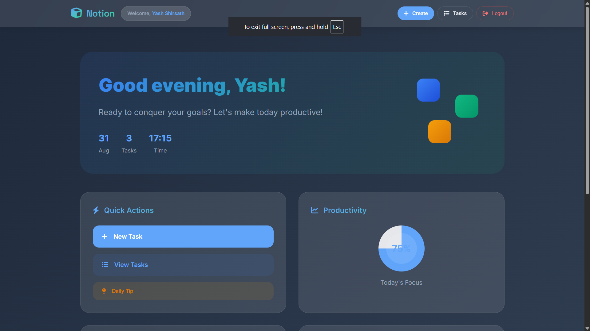
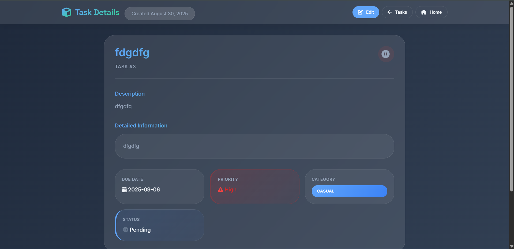
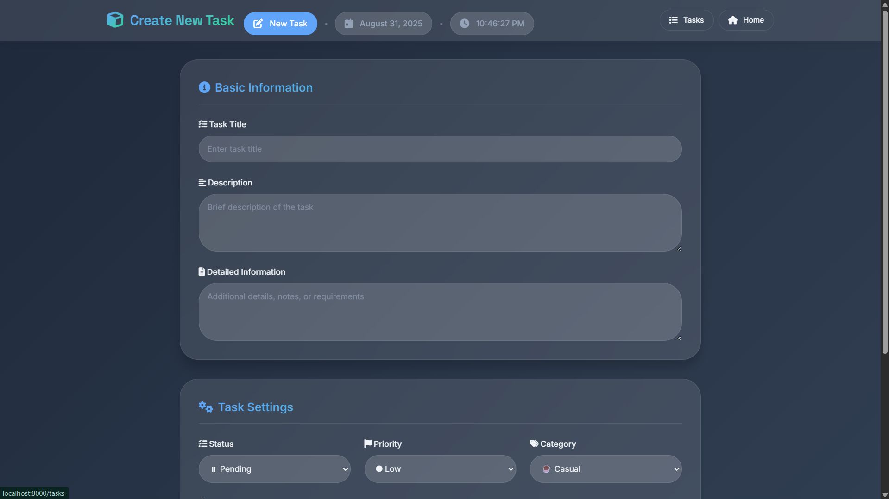
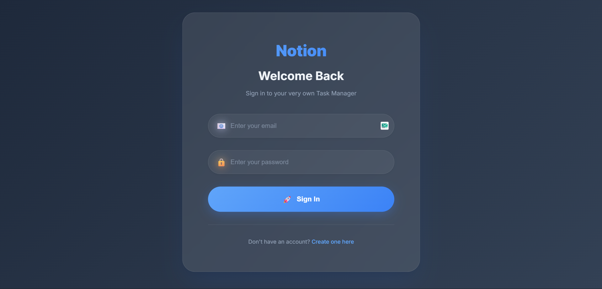

# Notion - Modern Laravel Task Managing Application

A comprehensive task management system built with Laravel, featuring a modern UI design and advanced task organization capabilities.

## 🚀 Features

### Core Functionality

-   **User Authentication** - Secure login/register system with custom styling
-   **CRUD Operations** - Create, read, update, and delete tasks
-   **Task Prioritization** - High, Medium, Low priority levels with color coding
-   **Due Date Management** - Date tracking with overdue detection
-   **Task Categories** - Organize tasks by Business, Casual, Fun categories
-   **Status Tracking** - Pending, In Progress, Completed status management

## 📸 Screenshots

Screenshots are stored in Notion/screenshots. Paths below are relative to the repository root.

### Task Management






### Forms , Dashboards and Registration






## 🛠️ Technology Stack

-   **Backend**: Laravel (PHP)
-   **Frontend**: Blade Templates, HTML5, CSS3, JavaScript
-   **Database**: MySQL/SQLite
-   **Styling**: Custom CSS with Glassmorphism effects
-   **Fonts**: Inter, Playwrite DE Grund
-   **Icons**: Emoji-based icon system

## 📱 User Interface

### Dashboard Features

-   User profile display with gradient styling
-   Welcome message with highlighted username
-   Quick navigation to all sections

### Task Management

-   **Task Cards** - Glassmorphism design with priority borders
-   **Meta Information** - Due dates, priority badges, category labels
-   **Action Buttons** - View, Edit, Delete with confirmation
-   **Completion System** - Toggle completion status with visual feedback

## 🎨 Design Philosophy

The application follows a modern design approach with:

-   **Glassmorphism** - Translucent elements with backdrop blur
-   **Color Psychology** - Priority-based color coding for quick recognition
-   **Minimal Animations** - Subtle effects that enhance usability
-   **Responsive Design** - Mobile-first approach with adaptive layouts
-   **Accessibility** - High contrast ratios and keyboard navigation support

## 🚀 Installation

1. Clone the repository

```bash
git clone https://github.com/YashSHIrsath/Notion.git
```

2. Install dependencies

```bash
composer install
npm install
```

3. Set up environment

```bash
cp .env.example .env
php artisan key:generate
```

4. Run migrations

```bash
php artisan migrate
```

5. Start the development server

```bash
php artisan serve
```

## 📄 License

This project is open-sourced software licensed under the [MIT license](https://opensource.org/licenses/MIT).
